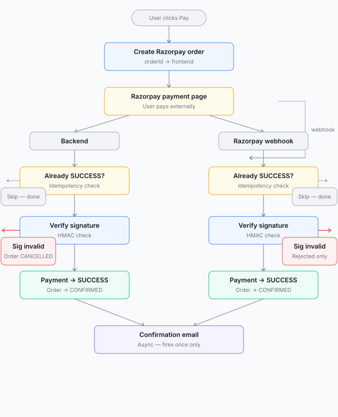
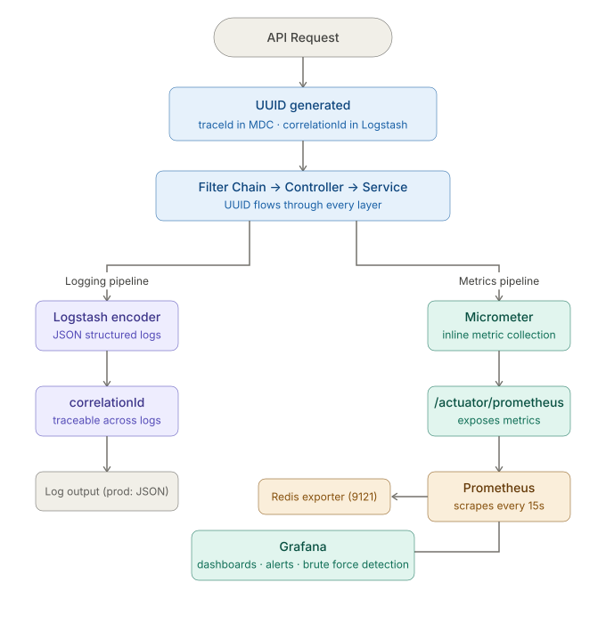
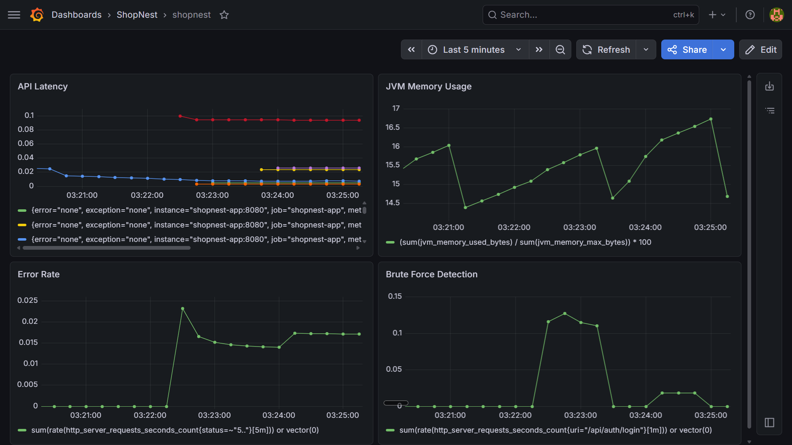
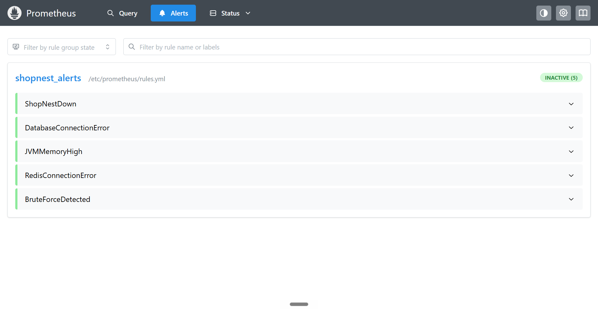
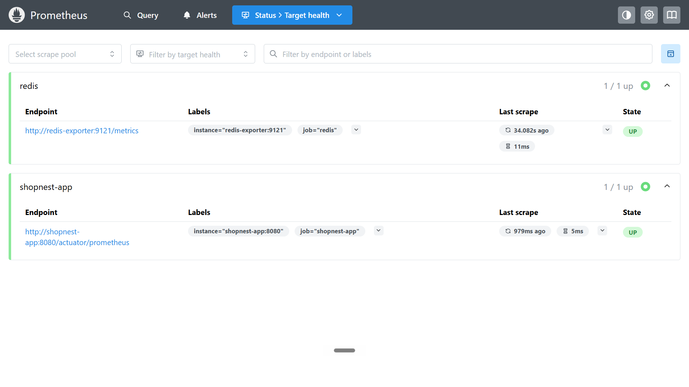

# ShopNest
Order and payment backend — built around the problems of
concurrent stock, duplicate payments, and abandoned orders.

---

## Architecture

<div align="center">

</div>

---

## What This Project Taught Me

I built this because I wanted to understand how a real system
works end to end. An ecommerce project forced me to think about
things I never thought about before — like what happens when two
users buy the last item at the same time, or what happens when a
payment webhook and the verify endpoint both try to confirm the
same order. Building and fixing these problems taught me how to
think about transactions, concurrency, and what can go wrong in
a real system.

**Problems I hit while building:**

**1. Spring Security was returning 500 instead of 401 for missing tokens.**
When a request had no token, the filter passed it through the chain.
Spring had no authentication set, so it threw a 500 internally.
Fixed with a custom `AuthenticationEntryPoint` wired into the filter —
it catches the request before the chain and returns 401 immediately.

**2. Stock was deducting before the order finished saving.**
`StockService` was running in its own transaction using `REQUIRES_NEW` —
it committed the moment stock was deducted. If the order failed after
that, stock was already gone. Changed to `MANDATORY` so stock deduction
runs inside the same transaction as the order. Both commit together
or both roll back together.

**3. Stock was being restored twice on the same order.**
The background scheduler and a manual cancel could both run at the
same time. Both called `restoreStock` independently — stock ended up
more than what actually existed. Fixed with a `stockRestored` flag
on the Order and a pessimistic lock. Lock lets only one request in
at a time. Flag stops the second one even if it gets through.

**4. Two users buying the last item at the same time — both read
stock=1, both try to save.**
Added `@Version` on Product. Database rejects the second write when
version does not match. `@Retryable` retries it with a fresh read.
No overselling without any manual lock.

---

## Payment Flow

<div align="center">

</div>

---

## Observability

<div align="center">

</div>

---

## Live

| | Link |
|--|------|
| Swagger | http://13.202.26.232:8080/swagger-ui/index.html |
| Grafana | http://13.202.26.232:3000 |
| Prometheus | http://13.202.26.232:9090 |

---

## Screenshots





---

## Tech Stack

| Technology | Purpose |
|------------|---------|
| Java 17 | Core language |
| Spring Boot 3.4.5 | Application framework |
| Spring Security + JWT | Authentication and authorization |
| Spring Data JPA | Database access |
| MySQL 8 | Primary database |
| Redis 7.2 | Caching and rate limiting |
| Razorpay | Payment gateway |
| Micrometer + Prometheus | Metrics collection |
| Grafana | Metrics visualization |
| Logstash Encoder | Structured JSON logging |
| Docker + Docker Compose | Containerization |
| Swagger / OpenAPI | API documentation |

---

## Setup

**Prerequisites**
- Docker and Docker Compose
- Razorpay account
- Gmail app password

```bash
git clone https://github.com/pavankumar-labs/shopnest.git
cd shopnest
cp .env.example .env
# Fill in your values in .env
docker compose up --build -d
```

---

## What I Would Add Next

**1. Right now placing an order and initiating payment are two separate
API calls. I want one endpoint that places the order and returns
the Razorpay payment link in the same response — so the frontend
gets everything it needs in one shot.**

**2. The background scheduler cancels abandoned orders silently.
If it stops running or cancels 50 orders in one go, there is
no way to know. I want to add a Prometheus metric that tracks
how many orders the scheduler cancels each run — so it shows
up in Grafana and an alert fires if the scheduler stops working.**
